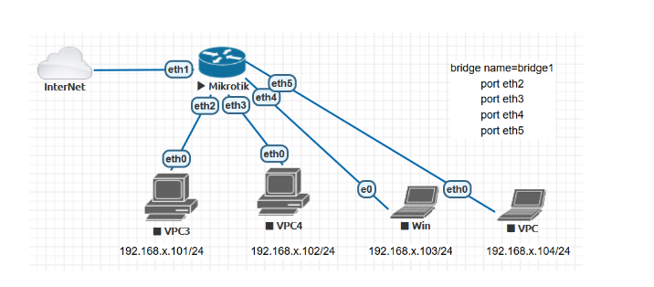

# LAB-18-Bridging
tanggal 16 Agustus 

# Bridging

 

beberapa interface (eth2, eth3, eth4, eth5) digabungkan dalam satu bridge 
agar semua perangkat berada pada satu network.

**Langkah Konfigurasi Bridging di Mikrotik:**

1. Masuk ke Winbox / Terminal Mikrotik
2. buat interface Bridge

    /interface bridge add name=bridge1

3. tambahkan Port ke Bridge
   
   /interface bridge port add bridge=bridge1 interface=eth2.   
   /interface bridge port add bridge=bridge1 interface=eth3.     
   /interface bridge port add bridge=bridge1 interface=eth4.     
   /interface bridge port add bridge=bridge1 interface=eth5.
       
4. Buat DHCP Client ke interface yang terhubung ke internet untuk akses internet
   IP > DHCP CLIENT.

   /ip dhcp-client add interface=ether1 use-peer-dns=yes use-peer-ntp=yes add-default-route=yes disabled=no

5. berikan IP Address pada Bridge

   /ip address add address=192.168.10.1/24 interface=bridge1
   
6. Setup DHCP server untuk interface bridge, dan atur range/pool nya menjadi 192.168.10.101-105
    IP > DHCP SERVER > DHCP SETUP

    /ip dhcp-server setup
    (bridge1)   

8. Tambahkan firewall NAT di IP > Firewall > NAT > add.

    /ip firewall nat add chain=srcnat action=masquerade out-interface=ether1

9. Aktifkan dan tambahkan DNS google di IP > DNS.

    /ip dns set server=8.8.8.8
    
10. Ubah IP di Client jadi auto/obtain auto lewat Control Panel.

10. Jika sudah terhubung bisa di setting di winbox IP > DHCP Server > Lease > Make static agar IP yang didapat tetap.
11. Cek Status

   /interface bridge print     
   /interface bridge port print

 12. Jika client sudah mendapat IP, coba ping di CMD.

# Kesimpulan
Bridging di Mikrotik menghubungkan beberapa port fisik ke dalam satu segment 
jaringan sehingga perangkat yang terhubung dapat berkomunikasi,
yang dapat di hubungkan melalui switch.
